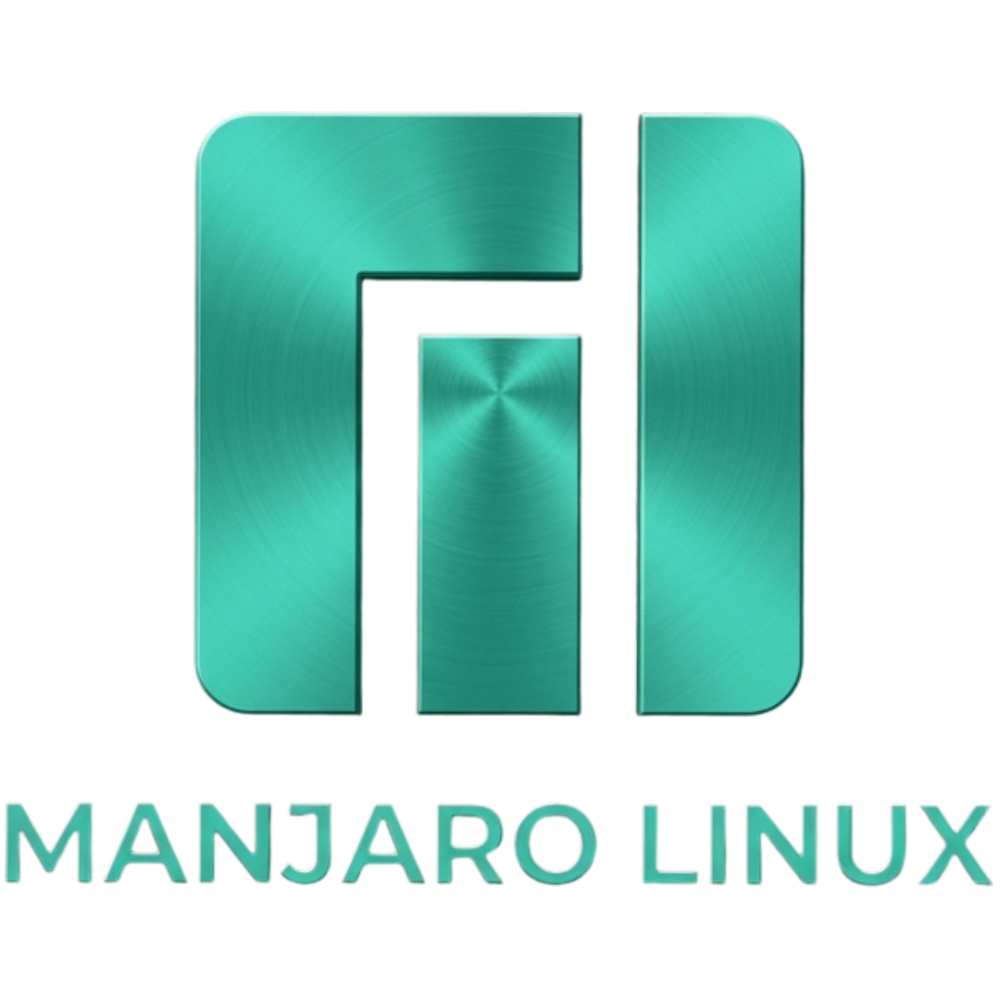
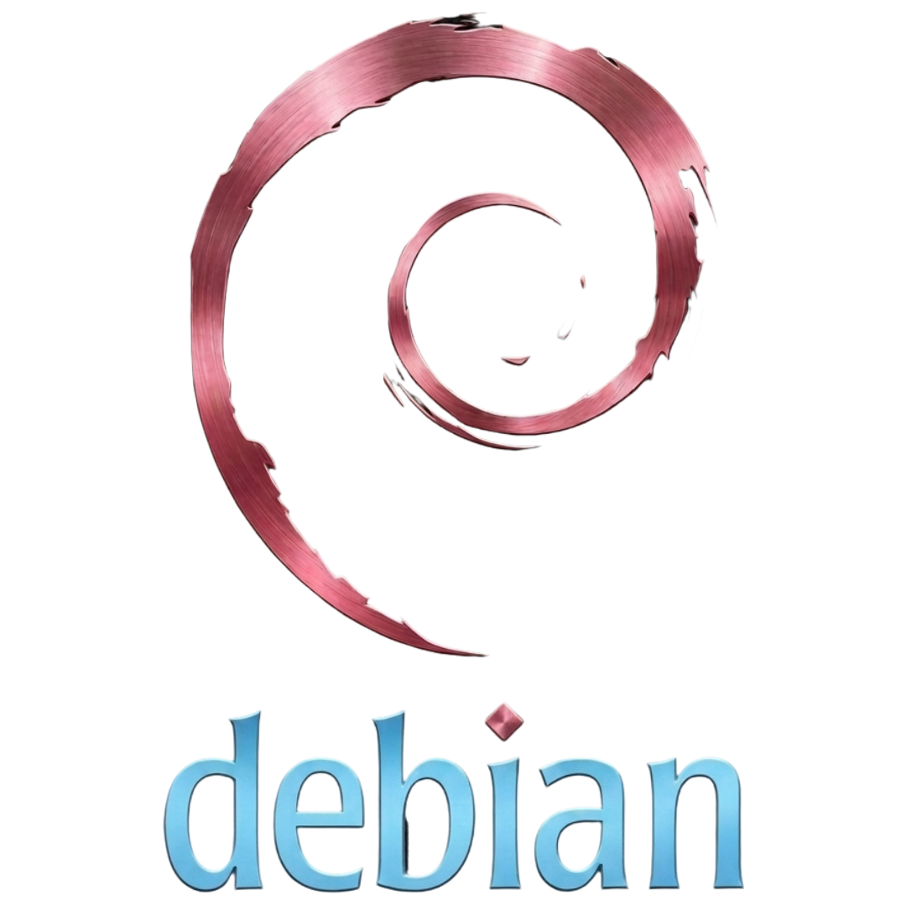
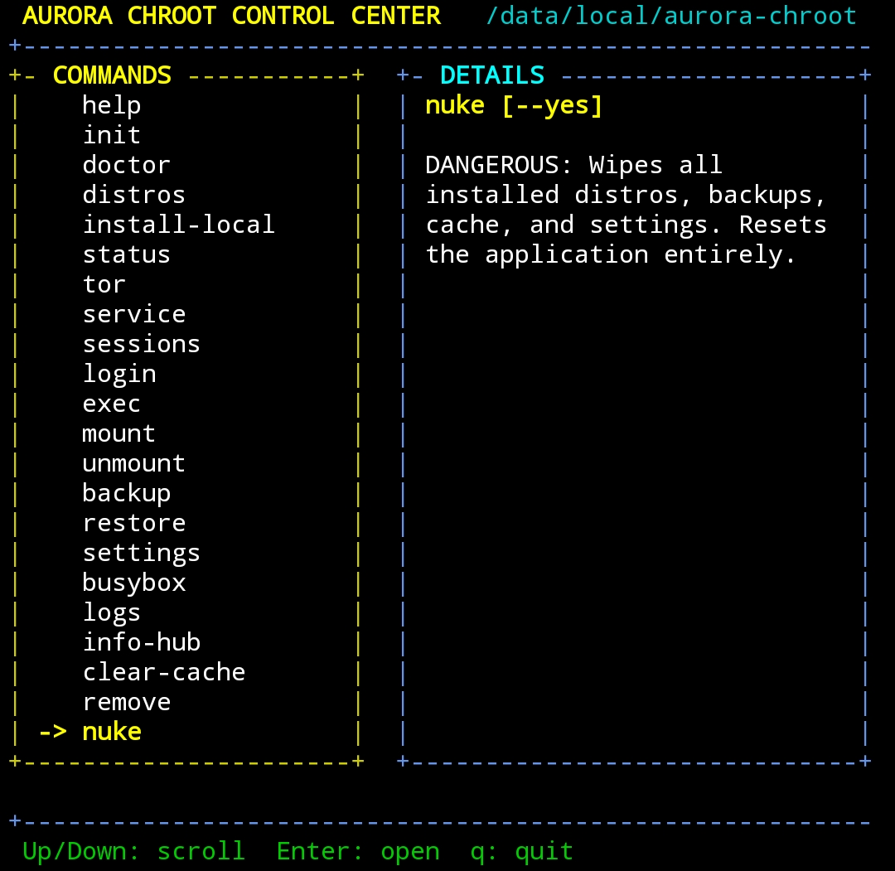
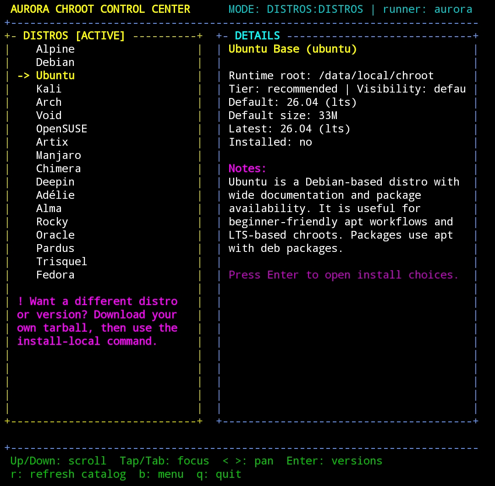
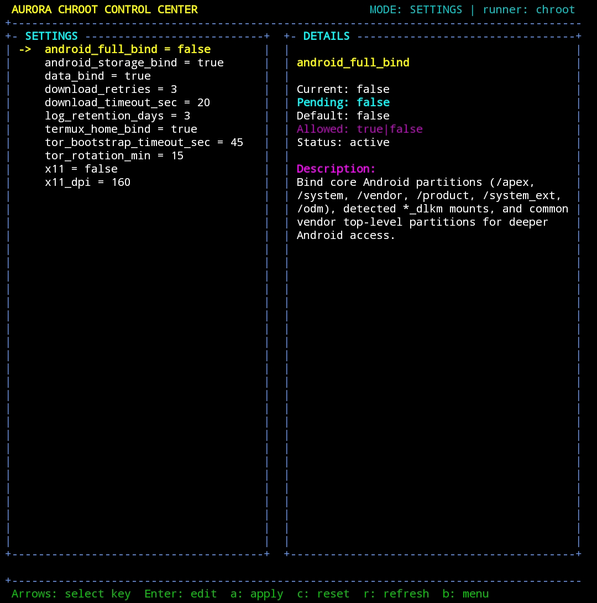
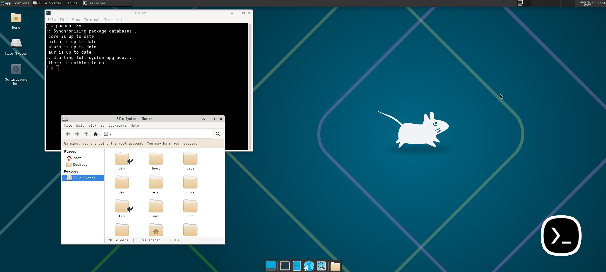
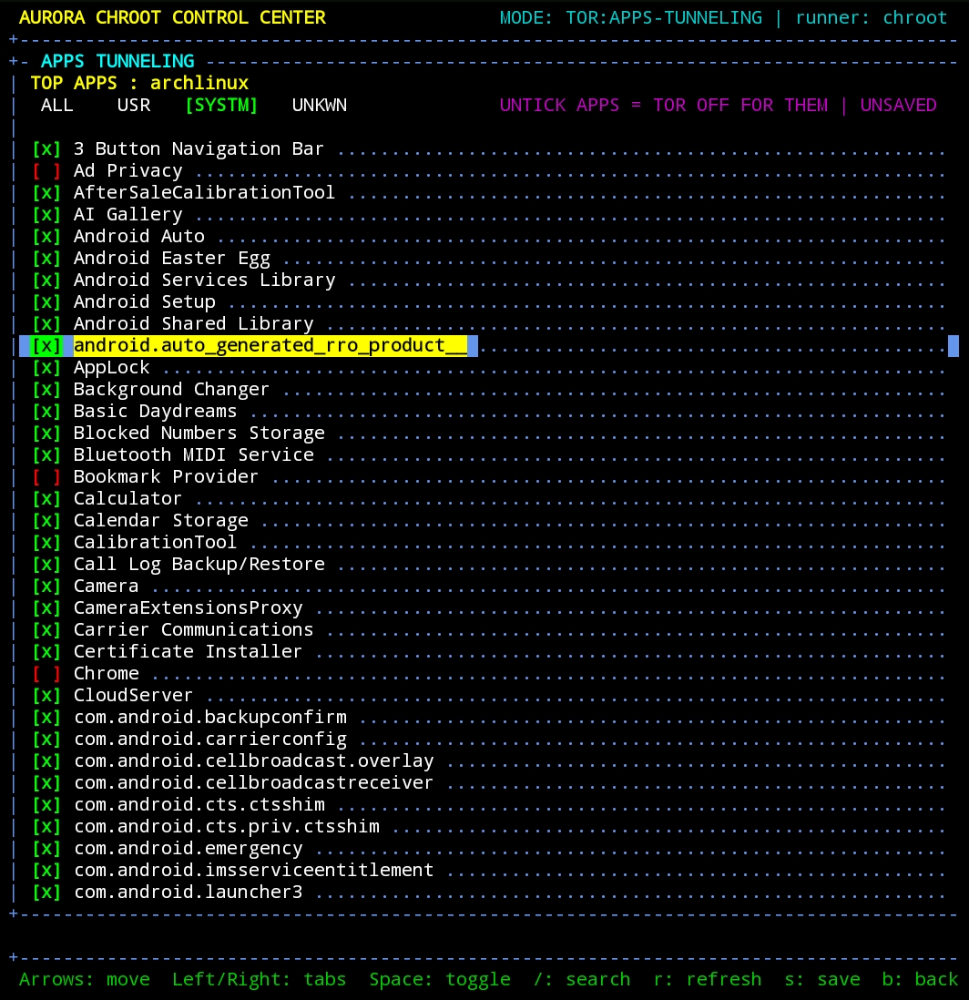
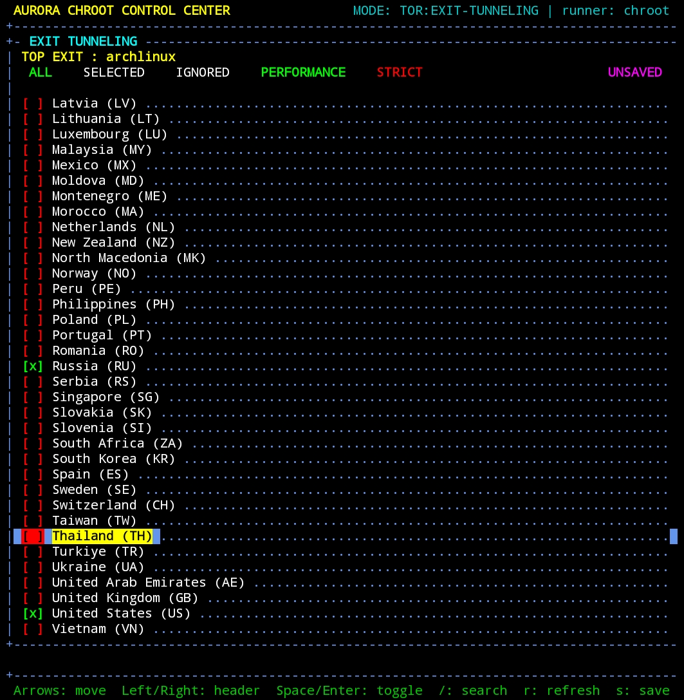
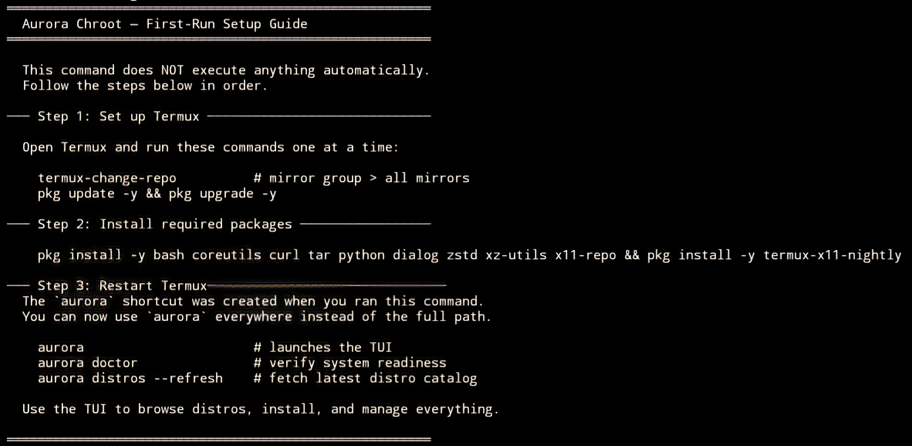

<div align="center">

# Aurora Chroot

<p><strong>The Most Universal and Feature-Rich Chroot Manager for Rooted Android Devices</strong></p>

<p>
  
  
  
  <a href="https://github.com/Achroot/Aurora-Chroot/releases">
    
  </a>
  <a href="LICENSE">
    
  </a>
</p>

<p>
  Aurora is beginner-friendly, with a full touch-friendly TUI that removes the need for complex CLI commands.<br>
  Advanced users get a complete CLI, listed in <code>chroot help raw</code>, with system-wide Tor, services, desktop GUI, X11 support, and more.
</p>

</div>

<div align="center">

<p>
<a href="docs/distros/Adelie.png"></a><!--
--><a href="docs/distros/Artix.png"></a><!--
--><a href="docs/distros/Manjaro.png"></a><!--
--><a href="docs/distros/Alma.png"></a><!--
--><a href="docs/distros/Alpine.png"></a><!--
--><a href="docs/distros/Chimera.png"></a>
</p>

<p>
<a href="docs/distros/Debian.png"></a><!--
--><a href="docs/distros/Deepin.png"></a><!--
--><a href="docs/distros/Fedora.png"></a><!--
--><a href="docs/distros/Kali.png"></a><!--
--><a href="docs/distros/Arch.png"></a><!--
--><a href="docs/distros/openSUSE.png"></a>
</p>

<p>
<a href="docs/distros/Oracle.png"></a><!--
--><a href="docs/distros/Pardus.png"></a><!--
--><a href="docs/distros/Rocky.png"></a><!--
--><a href="docs/distros/Trisquel.png"></a><!--
--><a href="docs/distros/Ubuntu.png"></a><!--
--><a href="docs/distros/Void.png"></a>
</p>

<p>
  <sub>Supported Distributions</sub>
</p>

</div>

## Table of Contents

<div align="center">

<pre>
&nbsp;<a href="#aurora-chroot">Aurora</a>
 /\
 /   \
<a href="#interface-preview">Preview</a>&nbsp;&nbsp;&nbsp;&nbsp;&nbsp;&nbsp;<a href="#desktop-gui">Desktop</a>
 /________\
<a href="#why-aurora-chroot">Perks</a>&nbsp;&nbsp;&nbsp;&nbsp;<a href="#built-in-tor-support">Tor</a>&nbsp;&nbsp;&nbsp;&nbsp;<a href="#step-by-step-first-setup">Setup</a>
/      |      \
<a href="#command-map">CLI</a>&nbsp;&nbsp;&nbsp;&nbsp;&nbsp;&nbsp;<a href="#what-the-repo-contains">Files</a>&nbsp;&nbsp;&nbsp;&nbsp;&nbsp;<a href="#requirements">Deps</a>
/        |        \
<a href="#safety">Safety</a>&nbsp;&nbsp;&nbsp;&nbsp;&nbsp;&nbsp;&nbsp;<a href="#documentation">Docs</a>&nbsp;&nbsp;&nbsp;&nbsp;&nbsp;&nbsp;<a href="#license">License</a>
</pre>

</div>

## Interface Preview

Aurora includes a keyboard-first + touch-friendly TUI for distro browsing, runtime control, settings management, etc.

<table align="center">
  <tr>
    <td align="center">
      <a href="docs/screenshots/main-tui-menu.jpg">
        
      </a>
    </td>
    <td align="center">
      <a href="docs/screenshots/live-distros.jpg">
        
      </a>
    </td>
    <td align="center">
      <a href="docs/screenshots/settings.jpg">
        
      </a>
    </td>
  </tr>
</table>

<p align="center">
  <sub>Main TUI menu</sub> • <sub>Live distro browser</sub> • <sub>Integrated settings editor</sub>
</p>

## Desktop GUI

Aurora can install and manage full Linux desktop sessions directly from the existing `service` flow.

<p align="center">
  <a href="docs/screenshots/Desktop.jpg">
    
  </a><br>
  <sub>Desktop GUI support managed through Aurora's built-in <code>desktop</code> service</sub>
</p>

## Why Aurora Chroot

- **One Bundled File:** Download one `chroot` file and run it. No Magisk module, no repo cloning, and no complex setup commands.
- **Beginner-Friendly TUI:** Touch-friendly interface for installs, sessions, and settings.
- **Full CLI:** Direct commands for advanced users who want full control.
- **Supported Distros:** Supports 18 popular distros, including Ubuntu, Kali, Arch Linux, and more.
- **Desktop GUI:** Managed `XFCE` and `LXQt` desktop profiles with X11 support.
- **Session-Aware Workflow:** Mount, login, exec, services, and removal built around live distro state.
- **Backups Built In:** Full, rootfs-only, and state-only backup and restore support.
- **Built-In Services:** Includes `desktop`, `sshd`, `pcbridge`, and distro-specific `zsh` setup.
- **Diagnostics Included:** Root-backend checks, BusyBox fallback guidance, and preflight troubleshooting through `doctor`.
- **Built-In Tor:** System-wide Tor with TUI and CLI control.

## Built-In Tor Support

- **CLI And TUI Control:** Manage Tor from direct commands or Aurora's built-in interface.
- **Automatic Tor Setup:** Installs and configures Tor inside supported distros when it is missing.
- **Apps Tunneling:** Save Android apps as tunneled or bypassed for configured Tor runs.
- **Exit Tunneling:** Save preferred exit countries, optional strict mode, or live performance mode with optional ignored countries for configured Tor runs.
- **Performance Mode:** Uses live Tor relay data to choose a fast exit with the highest download speed possible at runtime.
- **Runtime Tools:** Includes `status`, `doctor`, `newnym`, and `freeze` for active Tor sessions.

<table align="center">
  <tr>
    <td align="center">
      <a href="docs/screenshots/Apps-Tunneling.jpg">
        
      </a><br>
      <sub>Apps Tunneling</sub>
    </td>
    <td align="center">
      <a href="docs/screenshots/Exit-Tunneling.jpg">
        
      </a><br>
      <sub>Exit Tunneling</sub>
    </td>
  </tr>
</table>

## Step-By-Step First Setup

<p>
  <a href="https://github.com/Achroot/Aurora-Chroot/releases/latest">
    
  </a>
</p>

- Download `chroot` from the latest GitHub Release.
- Save it anywhere on the phone.

> [!TIP]
> Run the following commands in order inside Termux.

1. Grant storage permission.

    ```bash
    termux-setup-storage
    ```

2. Refresh mirrors.

    ```bash
    termux-change-repo   # mirror group > all mirrors
    ```

3. Update and upgrade Termux packages.

    ```bash
    pkg update && pkg upgrade -y
    ```

4. Install all required packages.

    ```bash
    pkg install -y bash coreutils curl tar python dialog zstd xz-utils x11-repo && pkg install -y termux-x11-nightly
    ```

5. Run the downloaded `chroot` script.

    ```bash
    bash /storage/emulated/0/Download/chroot
    ```

6. Restart Termux and use `aurora` to run commands.

    ```bash
    aurora
    ```

> [!NOTE]
> When `chroot` is invoked using its full path, Aurora creates or updates the `aurora` launcher so it points to the current `chroot` location.

<p align="center">
  <a href="docs/screenshots/init.jpg">
    
  </a><br>
  <sub>First-run setup guide shown by <code>init</code></sub>
</p>

## Command Map

| Area | Commands |
| --- | --- |
| Setup and diagnostics | `init`, `doctor`, `settings`, `busybox`, `logs`, `info` |
| Distro lifecycle | `distros`, `install-local`, `remove`, `nuke` |
| Runtime access | `login`, `exec`, `mount`, `unmount` |
| State and operations | `status`, `tor`, `sessions`, `service` |
| Data management | `backup`, `restore`, `clear-cache` |

For the full command reference, run `chroot help` or `chroot help raw`.

The `service` command also includes the built-in desktop GUI flow, alongside `sshd`, `pcbridge`, and `zsh`.

## What The Repo Contains

| Path | Use |
| --- | --- |
| `main.sh` | CLI entrypoint |
| `lib/` | Bash feature modules |
| `lib/info/` | Device/runtime info collectors and CLI output |
| `lib/commands.sh` | Shared command metadata used by raw help, TUI command inventory/specs, and log action inference |
| <code>lib/<wbr>tui/<wbr>python/</code> | TUI Python components |
| <code>docs/</code> | Landing page screenshots & Distro logos|
| <code>tools/<wbr>bundle.sh</code> | Builds dist/chroot |
| <code>tools/<wbr>registry-audit.sh</code> | Audits command-registry, TUI, and handler consistency for development/review |
| <code>lib/<wbr>help.sh</code> | Long-form help text, raw help rendering, and init copy |

## Requirements

- Rooted Android device
- Termux installed
- Basic comfort with terminal and root-level operations

## Safety

> [!WARNING]
> This software operates at the root/superuser level and modifies system mounts, filesystems, and processes on Android devices. The authors and contributors are NOT responsible for any damage, data loss, bricked devices, voided warranties, security vulnerabilities, or any other issues that may arise from using this software. Use entirely at your own risk. Always maintain backups of important data before using root-level tools.

## Documentation

- Command reference: `chroot help` / `chroot help raw`
- Developer audit: `bash tools/registry-audit.sh`
- License: [LICENSE](LICENSE)

## License

Aurora Chroot is licensed under 0BSD. See [LICENSE](LICENSE).
